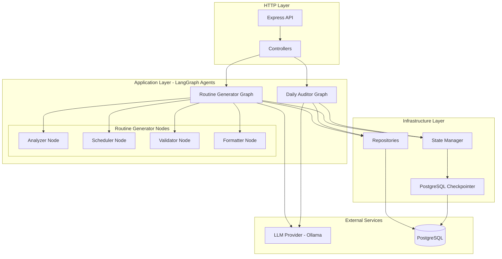
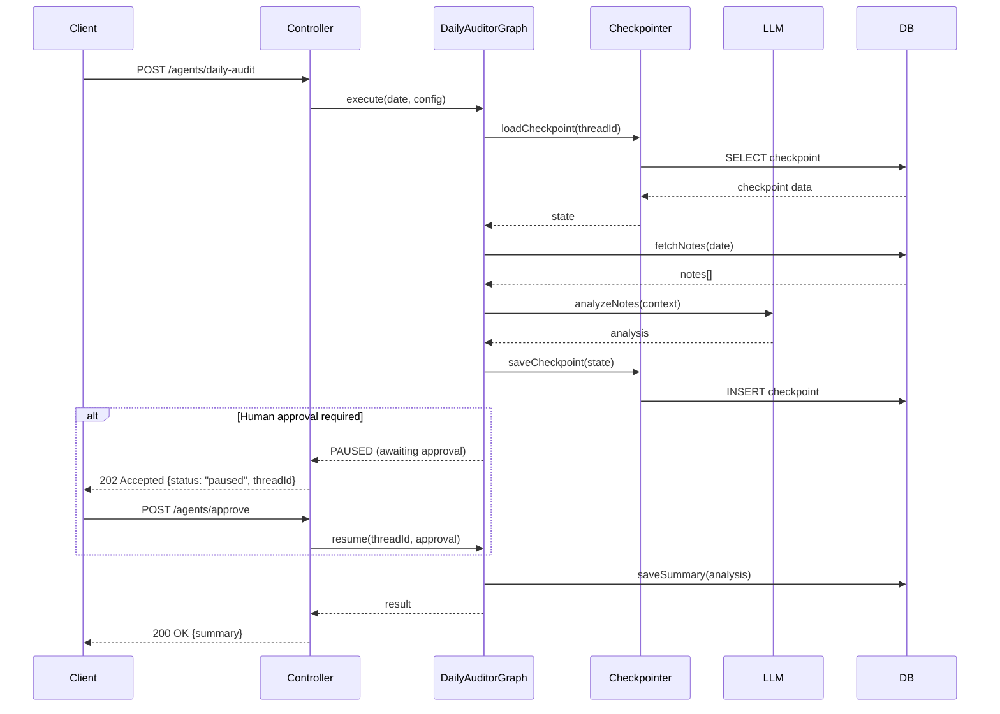
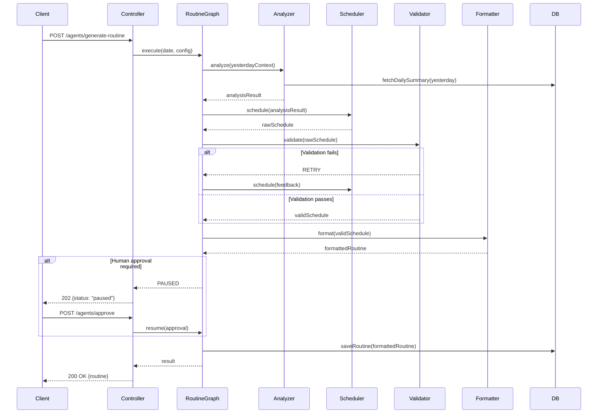

# Design Document: LangGraph Agent Migration

## Overview

This design transforms the existing Daily Auditor and Routine Generator agents from simple LangChain demos into production-grade, stateful agents using LangGraph. The migration introduces state management, checkpointing with PostgreSQL persistence, human-in-the-loop approval flows, and advanced error recovery mechanisms. The goal is to achieve 99% uptime with pause/resume functionality, multi-agent collaboration, and comprehensive observability.

The implementation maintains Clean Architecture principles, keeping agents as use cases while adding new infrastructure for state persistence and graph execution. Existing API contracts remain intact, with new endpoints added for pause/resume/status operations.

## Architecture




## Main Workflow Sequence Diagrams

### Daily Auditor Workflow



### Routine Generator Multi-Agent Workflow




## Components and Interfaces

### LangGraph State Interfaces

```typescript
// Base state for all agents
interface BaseAgentState {
    threadId: string;
    status: 'running' | 'paused' | 'completed' | 'failed';
    currentNode: string;
    error?: string;
    retryCount: number;
    createdAt: Date;
    updatedAt: Date;
}

// Daily Auditor State
interface DailyAuditorState extends BaseAgentState {
    date: string;
    notes: Array<{ id: string; content: string; createdAt: Date }>;
    analysis: {
        summary: string;
        riskLevel: number;
        keyInsights: string[];
    } | null;
    requiresApproval: boolean;
    approved: boolean;
}

// Routine Generator State
interface RoutineGeneratorState extends BaseAgentState {
    date: string;
    yesterdayContext: string;
    analysisResult: {
        riskLevel: number;
        recommendations: string[];
    } | null;
    rawSchedule: any | null;
    validatedSchedule: any | null;
    formattedRoutine: {
        activities: Array<{
            time: string;
            activity: string;
            expectedBenefit: string;
        }>;
    } | null;
    validationAttempts: number;
    requiresApproval: boolean;
    approved: boolean;
}
```

**Responsibilities:**
- Define the shape of state that flows through the graph
- Track execution progress and status
- Store intermediate results between nodes
- Handle approval workflow state

### Graph Configuration Interface

```typescript
interface GraphConfig {
    threadId?: string;
    checkpointId?: string;
    maxRetries?: number;
    requiresHumanApproval?: boolean;
    timeout?: number;
}

interface GraphExecutionResult<T> {
    success: boolean;
    state: T;
    threadId: string;
    status: 'completed' | 'paused' | 'failed';
    error?: string;
}
```

**Responsibilities:**
- Configure graph execution behavior
- Control retry policies and timeouts
- Enable/disable human-in-the-loop
- Return standardized execution results


### Checkpointer Interface

```typescript
interface Checkpoint<T = any> {
    id: string;
    threadId: string;
    state: T;
    nodeId: string;
    createdAt: Date;
}

interface CheckpointerProvider {
    save<T>(threadId: string, state: T, nodeId: string): Promise<string>;
    load<T>(threadId: string, checkpointId?: string): Promise<Checkpoint<T> | null>;
    list(threadId: string): Promise<Checkpoint[]>;
    delete(threadId: string): Promise<void>;
}
```

**Responsibilities:**
- Persist graph state to PostgreSQL
- Load checkpoints for resume operations
- Support time-travel debugging
- Clean up old checkpoints

### Agent Graph Interface

```typescript
interface AgentGraph<TState extends BaseAgentState, TInput, TOutput> {
    execute(input: TInput, config?: GraphConfig): Promise<GraphExecutionResult<TState>>;
    resume(threadId: string, input?: Partial<TInput>): Promise<GraphExecutionResult<TState>>;
    getStatus(threadId: string): Promise<{ status: string; state: TState }>;
    cancel(threadId: string): Promise<void>;
}
```

**Responsibilities:**
- Execute graph from start or checkpoint
- Resume paused executions
- Query execution status
- Cancel running executions

### Node Function Interface

```typescript
type NodeFunction<TState> = (
    state: TState,
    config: GraphConfig
) => Promise<Partial<TState>>;

type ConditionalEdge<TState> = (
    state: TState
) => string; // Returns next node name
```

**Responsibilities:**
- Define individual node logic
- Return state updates
- Support conditional routing between nodes


## Data Models

### Checkpoint Table Schema

```typescript
// New table: agent_checkpoints
export const agentCheckpoints = pgTable("agent_checkpoints", {
    id: uuid("id").primaryKey().defaultRandom(),
    threadId: text("thread_id").notNull(),
    state: jsonb("state").notNull(),
    nodeId: text("node_id").notNull(),
    agentType: text("agent_type").notNull(), // "daily_auditor" | "routine_generator"
    createdAt: timestamp("created_at").defaultNow().notNull(),
});

// Index for fast lookups
// CREATE INDEX idx_checkpoints_thread ON agent_checkpoints(thread_id, created_at DESC);
```

**Validation Rules:**
- threadId must be non-empty string
- state must be valid JSON matching agent state interface
- nodeId must match a valid node in the graph
- agentType must be one of the supported agent types

### Agent Execution Log Schema

```typescript
// New table: agent_execution_logs
export const agentExecutionLogs = pgTable("agent_execution_logs", {
    id: uuid("id").primaryKey().defaultRandom(),
    threadId: text("thread_id").notNull(),
    agentType: text("agent_type").notNull(),
    status: text("status").notNull(), // "running" | "paused" | "completed" | "failed"
    input: jsonb("input").notNull(),
    output: jsonb("output"),
    error: text("error"),
    durationMs: integer("duration_ms"),
    retryCount: integer("retry_count").default(0),
    startedAt: timestamp("started_at").defaultNow().notNull(),
    completedAt: timestamp("completed_at"),
});

// Index for monitoring and analytics
// CREATE INDEX idx_execution_logs_status ON agent_execution_logs(status, started_at DESC);
// CREATE INDEX idx_execution_logs_agent ON agent_execution_logs(agent_type, started_at DESC);
```

**Validation Rules:**
- threadId must match checkpoint threadId
- status must be valid enum value
- durationMs must be positive integer when set
- completedAt must be after startedAt

### Agent Metrics Schema

```typescript
// New table: agent_metrics
export const agentMetrics = pgTable("agent_metrics", {
    id: uuid("id").primaryKey().defaultRandom(),
    agentType: text("agent_type").notNull(),
    date: date("date").notNull(),
    totalExecutions: integer("total_executions").default(0),
    successfulExecutions: integer("successful_executions").default(0),
    failedExecutions: integer("failed_executions").default(0),
    avgDurationMs: integer("avg_duration_ms"),
    p95DurationMs: integer("p95_duration_ms"),
    totalRetries: integer("total_retries").default(0),
    createdAt: timestamp("created_at").defaultNow().notNull(),
});

// Unique constraint on agent_type + date
// CREATE UNIQUE INDEX idx_metrics_agent_date ON agent_metrics(agent_type, date);
```

**Validation Rules:**
- totalExecutions = successfulExecutions + failedExecutions
- All duration metrics must be positive integers
- Date must be valid ISO date string


## Algorithmic Pseudocode

### Daily Auditor Graph Algorithm

```typescript
ALGORITHM DailyAuditorGraph
INPUT: date (string), config (GraphConfig)
OUTPUT: GraphExecutionResult<DailyAuditorState>

PRECONDITIONS:
- date is valid ISO date string (YYYY-MM-DD)
- config.threadId is unique or undefined (will generate new)
- Database connection is available

POSTCONDITIONS:
- Returns completed state with analysis OR paused state awaiting approval
- Checkpoint saved after each node execution
- Execution log created with final status

BEGIN
  // Initialize or restore state
  IF config.threadId exists THEN
    state ← loadCheckpoint(config.threadId)
    ASSERT state.date = date
  ELSE
    state ← createInitialState(date, generateThreadId())
  END IF
  
  // Node 1: Fetch Notes
  IF state.currentNode = "start" OR state.currentNode = "fetchNotes" THEN
    state.notes ← fetchNotesForDay(date)
    state.currentNode ← "analyzeNotes"
    saveCheckpoint(state)
    
    IF state.notes.length = 0 THEN
      state.status ← "completed"
      RETURN GraphExecutionResult(success: true, state, status: "completed")
    END IF
  END IF
  
  // Node 2: Analyze Notes with LLM
  IF state.currentNode = "analyzeNotes" THEN
    TRY
      context ← concatenateNotes(state.notes)
      state.analysis ← callLLMForAnalysis(context)
      state.currentNode ← "checkApproval"
      state.retryCount ← 0
      saveCheckpoint(state)
    CATCH error
      state.retryCount ← state.retryCount + 1
      
      IF state.retryCount >= config.maxRetries THEN
        state.status ← "failed"
        state.error ← error.message
        logExecutionFailure(state)
        RETURN GraphExecutionResult(success: false, state, status: "failed")
      ELSE
        // Exponential backoff retry
        wait(2^state.retryCount * 1000)
        RETRY analyzeNotes
      END IF
    END TRY
  END IF
  
  // Node 3: Check Approval Requirement
  IF state.currentNode = "checkApproval" THEN
    IF config.requiresHumanApproval AND state.analysis.riskLevel >= 7 THEN
      state.requiresApproval ← true
      state.status ← "paused"
      state.currentNode ← "awaitingApproval"
      saveCheckpoint(state)
      RETURN GraphExecutionResult(success: true, state, status: "paused")
    ELSE
      state.currentNode ← "saveSummary"
    END IF
  END IF
  
  // Node 4: Awaiting Approval (resume point)
  IF state.currentNode = "awaitingApproval" THEN
    IF state.approved = true THEN
      state.currentNode ← "saveSummary"
    ELSE
      state.status ← "completed"
      RETURN GraphExecutionResult(success: true, state, status: "completed")
    END IF
  END IF
  
  // Node 5: Save Summary
  IF state.currentNode = "saveSummary" THEN
    saveDailySummary(state.date, state.analysis)
    state.status ← "completed"
    state.currentNode ← "end"
    saveCheckpoint(state)
    logExecutionSuccess(state)
  END IF
  
  RETURN GraphExecutionResult(success: true, state, status: "completed")
END

LOOP INVARIANTS:
- state.threadId remains constant throughout execution
- state.retryCount never exceeds config.maxRetries
- Each checkpoint save increments checkpoint version
- state.currentNode always points to valid node or "end"
```


### Routine Generator Multi-Agent Graph Algorithm

```typescript
ALGORITHM RoutineGeneratorGraph
INPUT: date (string), config (GraphConfig)
OUTPUT: GraphExecutionResult<RoutineGeneratorState>

PRECONDITIONS:
- date is valid ISO date string (YYYY-MM-DD)
- Yesterday's date has daily summary available (or handle gracefully)
- config.threadId is unique or undefined

POSTCONDITIONS:
- Returns completed state with formatted routine OR paused state
- All validation attempts logged
- Routine saved to database if approved

BEGIN
  // Initialize or restore state
  IF config.threadId exists THEN
    state ← loadCheckpoint(config.threadId)
  ELSE
    state ← createInitialState(date, generateThreadId())
  END IF
  
  // Node 1: Analyzer - Get Yesterday Context
  IF state.currentNode = "start" OR state.currentNode = "analyzer" THEN
    yesterday ← calculateYesterday(date)
    summary ← fetchDailySummary(yesterday)
    
    IF summary exists THEN
      state.yesterdayContext ← formatContext(summary)
      state.analysisResult ← {
        riskLevel: summary.riskLevel,
        recommendations: extractRecommendations(summary.keyInsights)
      }
    ELSE
      state.yesterdayContext ← "No hay datos previos."
      state.analysisResult ← {
        riskLevel: 5,
        recommendations: ["Establecer rutina básica de bienestar"]
      }
    END IF
    
    state.currentNode ← "scheduler"
    saveCheckpoint(state)
  END IF
  
  // Node 2: Scheduler - Generate Schedule
  IF state.currentNode = "scheduler" THEN
    TRY
      prompt ← buildSchedulerPrompt(state.date, state.analysisResult)
      response ← callLLM(prompt)
      state.rawSchedule ← parseJSON(response)
      state.currentNode ← "validator"
      state.retryCount ← 0
      saveCheckpoint(state)
    CATCH error
      state.retryCount ← state.retryCount + 1
      
      IF state.retryCount >= config.maxRetries THEN
        state.status ← "failed"
        state.error ← "Scheduler failed after max retries"
        RETURN GraphExecutionResult(success: false, state, status: "failed")
      ELSE
        wait(2^state.retryCount * 1000)
        RETRY scheduler
      END IF
    END TRY
  END IF
  
  // Node 3: Validator - Validate Schedule
  IF state.currentNode = "validator" THEN
    validationResult ← validateSchedule(state.rawSchedule)
    state.validationAttempts ← state.validationAttempts + 1
    
    IF validationResult.isValid THEN
      state.validatedSchedule ← state.rawSchedule
      state.currentNode ← "formatter"
      saveCheckpoint(state)
    ELSE
      IF state.validationAttempts >= 3 THEN
        state.status ← "failed"
        state.error ← "Schedule validation failed after 3 attempts"
        RETURN GraphExecutionResult(success: false, state, status: "failed")
      ELSE
        // Feedback loop: return to scheduler with validation errors
        state.analysisResult.recommendations.push(validationResult.feedback)
        state.currentNode ← "scheduler"
        saveCheckpoint(state)
        GOTO scheduler
      END IF
    END IF
  END IF
  
  // Node 4: Formatter - Format Activities
  IF state.currentNode = "formatter" THEN
    state.formattedRoutine ← {
      activities: normalizeActivities(state.validatedSchedule)
    }
    state.currentNode ← "checkApproval"
    saveCheckpoint(state)
  END IF
  
  // Node 5: Check Approval Requirement
  IF state.currentNode = "checkApproval" THEN
    IF config.requiresHumanApproval THEN
      state.requiresApproval ← true
      state.status ← "paused"
      state.currentNode ← "awaitingApproval"
      saveCheckpoint(state)
      RETURN GraphExecutionResult(success: true, state, status: "paused")
    ELSE
      state.currentNode ← "saveRoutine"
    END IF
  END IF
  
  // Node 6: Awaiting Approval (resume point)
  IF state.currentNode = "awaitingApproval" THEN
    IF state.approved = true THEN
      state.currentNode ← "saveRoutine"
    ELSE
      state.status ← "completed"
      RETURN GraphExecutionResult(success: true, state, status: "completed")
    END IF
  END IF
  
  // Node 7: Save Routine
  IF state.currentNode = "saveRoutine" THEN
    saveRoutine(state.date, state.formattedRoutine.activities)
    state.status ← "completed"
    state.currentNode ← "end"
    saveCheckpoint(state)
    logExecutionSuccess(state)
  END IF
  
  RETURN GraphExecutionResult(success: true, state, status: "completed")
END

LOOP INVARIANTS:
- state.validationAttempts never exceeds 3
- Each scheduler retry includes previous validation feedback
- state.threadId remains constant
- Checkpoints saved after each node transition
```


### Schedule Validation Algorithm

```typescript
ALGORITHM validateSchedule
INPUT: rawSchedule (any)
OUTPUT: { isValid: boolean, feedback: string }

PRECONDITIONS:
- rawSchedule is parsed JSON object

POSTCONDITIONS:
- Returns validation result with actionable feedback
- isValid = true if and only if all validation rules pass

BEGIN
  // Rule 1: Check structure
  IF NOT hasProperty(rawSchedule, "activities") THEN
    RETURN { isValid: false, feedback: "Missing 'activities' array" }
  END IF
  
  IF NOT isArray(rawSchedule.activities) THEN
    RETURN { isValid: false, feedback: "'activities' must be an array" }
  END IF
  
  IF rawSchedule.activities.length = 0 THEN
    RETURN { isValid: false, feedback: "Activities array is empty" }
  END IF
  
  // Rule 2: Validate each activity
  FOR each activity IN rawSchedule.activities DO
    IF NOT hasProperty(activity, "time") THEN
      RETURN { isValid: false, feedback: "Activity missing 'time' field" }
    END IF
    
    IF NOT isValidTimeFormat(activity.time) THEN
      RETURN { isValid: false, feedback: "Invalid time format. Use HH:MM" }
    END IF
    
    IF NOT hasProperty(activity, "activity") THEN
      RETURN { isValid: false, feedback: "Activity missing 'activity' field" }
    END IF
    
    IF activity.activity.length < 3 THEN
      RETURN { isValid: false, feedback: "Activity description too short" }
    END IF
    
    IF NOT hasProperty(activity, "expectedBenefit") THEN
      RETURN { isValid: false, feedback: "Activity missing 'expectedBenefit' field" }
    END IF
  END FOR
  
  // Rule 3: Check time ordering
  times ← extractTimes(rawSchedule.activities)
  IF NOT isChronologicalOrder(times) THEN
    RETURN { isValid: false, feedback: "Activities must be in chronological order" }
  END IF
  
  // Rule 4: Check for reasonable coverage
  IF rawSchedule.activities.length < 3 THEN
    RETURN { isValid: false, feedback: "Schedule should have at least 3 activities" }
  END IF
  
  RETURN { isValid: true, feedback: "" }
END

LOOP INVARIANTS:
- All previously validated activities remain valid
- Validation stops at first error (fail-fast)
```


## Key Functions with Formal Specifications

### PostgreSQLCheckpointer.save()

```typescript
async save<T>(threadId: string, state: T, nodeId: string): Promise<string>
```

**Preconditions:**
- threadId is non-empty string
- state is serializable to JSON
- nodeId is valid node identifier
- Database connection is active

**Postconditions:**
- Returns checkpoint ID (UUID)
- Checkpoint persisted to agent_checkpoints table
- createdAt timestamp set to current time
- If save fails, throws error (no partial state)

**Implementation Notes:**
- Uses Drizzle ORM insert operation
- Wraps state in JSON.stringify for storage
- Generates UUID for checkpoint ID
- No transaction needed (single insert)

### PostgreSQLCheckpointer.load()

```typescript
async load<T>(threadId: string, checkpointId?: string): Promise<Checkpoint<T> | null>
```

**Preconditions:**
- threadId is non-empty string
- If checkpointId provided, must be valid UUID
- Database connection is active

**Postconditions:**
- Returns most recent checkpoint if checkpointId not provided
- Returns specific checkpoint if checkpointId provided
- Returns null if no checkpoint found
- State deserialized from JSON to type T

**Implementation Notes:**
- Query ordered by createdAt DESC for latest
- Uses JSON.parse to deserialize state
- Returns null instead of throwing on not found

### DailyAuditorGraph.execute()

```typescript
async execute(
    input: { date: string }, 
    config?: GraphConfig
): Promise<GraphExecutionResult<DailyAuditorState>>
```

**Preconditions:**
- input.date is valid ISO date string (YYYY-MM-DD)
- config.threadId is unique if provided
- LLM provider is available
- Database connection is active

**Postconditions:**
- Returns result with status: "completed", "paused", or "failed"
- If completed: state.analysis is populated and saved to database
- If paused: state.requiresApproval = true, awaiting resume
- If failed: state.error contains error message
- Checkpoint saved after each node execution
- Execution log created with final status

**Loop Invariants:**
- state.retryCount never exceeds config.maxRetries (default: 3)
- state.currentNode always points to valid node in graph
- Each checkpoint has unique ID and increasing createdAt

### DailyAuditorGraph.resume()

```typescript
async resume(
    threadId: string, 
    input?: { approved: boolean }
): Promise<GraphExecutionResult<DailyAuditorState>>
```

**Preconditions:**
- threadId exists in checkpoints table
- Checkpoint state.status = "paused"
- Checkpoint state.currentNode = "awaitingApproval"
- input.approved is boolean if provided

**Postconditions:**
- If approved = true: execution continues to saveSummary node
- If approved = false: execution completes without saving
- Returns updated GraphExecutionResult
- New checkpoint saved with updated state

**Implementation Notes:**
- Loads checkpoint by threadId
- Updates state.approved field
- Continues graph execution from current node
- Handles case where approval not provided (defaults to false)


### RoutineGeneratorGraph.execute()

```typescript
async execute(
    input: { date: string }, 
    config?: GraphConfig
): Promise<GraphExecutionResult<RoutineGeneratorState>>
```

**Preconditions:**
- input.date is valid ISO date string (YYYY-MM-DD)
- config.threadId is unique if provided
- LLM provider is available
- Database connection is active

**Postconditions:**
- Returns result with status: "completed", "paused", or "failed"
- If completed: state.formattedRoutine is populated and saved
- If paused: state.requiresApproval = true
- If failed: state.error contains error message
- state.validationAttempts never exceeds 3
- Checkpoint saved after each node execution

**Loop Invariants:**
- state.validationAttempts ≤ 3
- If validation fails, feedback added to state.analysisResult.recommendations
- Each scheduler retry includes cumulative feedback
- state.threadId remains constant throughout execution

### MetricsCollector.recordExecution()

```typescript
async recordExecution(
    agentType: string,
    status: string,
    durationMs: number,
    retryCount: number
): Promise<void>
```

**Preconditions:**
- agentType is valid agent type ("daily_auditor" | "routine_generator")
- status is valid status ("completed" | "failed")
- durationMs is positive integer
- retryCount is non-negative integer

**Postconditions:**
- Execution log created in agent_execution_logs table
- Daily metrics updated in agent_metrics table (upsert)
- totalExecutions incremented by 1
- successfulExecutions or failedExecutions incremented based on status
- avgDurationMs recalculated
- totalRetries incremented by retryCount

**Implementation Notes:**
- Uses database transaction for atomicity
- Calculates rolling average for avgDurationMs
- Updates or inserts metrics for current date
- No return value (fire-and-forget logging)


## Example Usage

### Daily Auditor - Basic Execution

```typescript
// Initialize graph with dependencies
const dailyAuditorGraph = new DailyAuditorGraph(
    llmProvider,
    repositories,
    checkpointer
);

// Execute for today's date
const result = await dailyAuditorGraph.execute(
    { date: '2024-01-15' },
    { requiresHumanApproval: true, maxRetries: 3 }
);

if (result.status === 'completed') {
    console.log('Daily audit completed:', result.state.analysis);
} else if (result.status === 'paused') {
    console.log('Awaiting approval. ThreadId:', result.threadId);
}
```

### Daily Auditor - Resume After Approval

```typescript
// User approves the analysis
const resumeResult = await dailyAuditorGraph.resume(
    'thread-uuid-123',
    { approved: true }
);

console.log('Execution resumed:', resumeResult.status);
```

### Routine Generator - Multi-Agent Execution

```typescript
// Initialize routine generator graph
const routineGraph = new RoutineGeneratorGraph(
    llmProvider,
    repositories,
    checkpointer
);

// Execute with automatic retry and validation
const result = await routineGraph.execute(
    { date: '2024-01-16' },
    { requiresHumanApproval: false, maxRetries: 3 }
);

if (result.status === 'completed') {
    console.log('Routine generated:', result.state.formattedRoutine);
    console.log('Validation attempts:', result.state.validationAttempts);
} else if (result.status === 'failed') {
    console.error('Failed after retries:', result.state.error);
}
```

### Checking Execution Status

```typescript
// Query status of running execution
const status = await dailyAuditorGraph.getStatus('thread-uuid-123');

console.log('Current node:', status.state.currentNode);
console.log('Status:', status.status);
console.log('Retry count:', status.state.retryCount);
```

### Controller Integration

```typescript
// AgentController.ts
export class AgentController implements Controller {
    public path = '/agents';
    public router = Router();

    constructor(
        private dailyAuditorGraph: DailyAuditorGraph,
        private routineGraph: RoutineGeneratorGraph
    ) {
        this.initializeRoutes();
    }

    private initializeRoutes() {
        this.router.post(`${this.path}/daily-audit`, this.executeDailyAudit.bind(this));
        this.router.post(`${this.path}/generate-routine`, this.executeRoutine.bind(this));
        this.router.post(`${this.path}/approve/:threadId`, this.approveExecution.bind(this));
        this.router.get(`${this.path}/status/:threadId`, this.getStatus.bind(this));
    }

    async executeDailyAudit(req: Request, res: Response) {
        const { date } = req.body;
        
        const result = await this.dailyAuditorGraph.execute(
            { date },
            { requiresHumanApproval: true }
        );

        if (result.status === 'paused') {
            res.status(202).json({
                message: 'Análisis completado, esperando aprobación',
                threadId: result.threadId,
                analysis: result.state.analysis
            });
        } else {
            res.status(200).json({
                message: 'Auditoría diaria completada',
                summary: result.state.analysis
            });
        }
    }

    async approveExecution(req: Request, res: Response) {
        const { threadId } = req.params;
        const { approved } = req.body;

        const result = await this.dailyAuditorGraph.resume(threadId, { approved });

        res.status(200).json({
            message: approved ? 'Ejecución aprobada y completada' : 'Ejecución cancelada',
            status: result.status
        });
    }
}
```


## Correctness Properties

### Universal Quantification Statements

**Property 1: Checkpoint Consistency**
```
∀ execution e, ∀ checkpoint c ∈ e.checkpoints:
  c.threadId = e.threadId ∧
  c.createdAt ≥ e.startedAt ∧
  c.state.currentNode ∈ validNodes(e.agentType)
```
Every checkpoint belongs to its execution thread, has a valid timestamp, and references a valid node.

**Property 2: State Monotonicity**
```
∀ execution e, ∀ checkpoints c1, c2 where c1.createdAt < c2.createdAt:
  c1.state.retryCount ≤ c2.state.retryCount ∧
  c1.state.validationAttempts ≤ c2.state.validationAttempts
```
Retry and validation counters never decrease during execution.

**Property 3: Terminal State Guarantee**
```
∀ execution e where e.status ∈ {"completed", "failed"}:
  e.state.currentNode = "end" ∨ e.state.error ≠ null
```
Every completed or failed execution reaches an end state or has an error recorded.

**Property 4: Approval Flow Correctness**
```
∀ execution e where e.config.requiresHumanApproval = true:
  (e.state.requiresApproval = true ⟹ e.status = "paused") ∧
  (e.status = "completed" ⟹ e.state.approved = true ∨ e.state.requiresApproval = false)
```
Executions requiring approval must pause, and can only complete if approved or approval not required.

**Property 5: Retry Bound**
```
∀ execution e, ∀ node n ∈ e.graph:
  e.state.retryCount ≤ e.config.maxRetries
```
No node execution exceeds the configured maximum retry count.

**Property 6: Validation Feedback Loop**
```
∀ execution e of RoutineGenerator:
  e.state.validationAttempts > 1 ⟹
  |e.state.analysisResult.recommendations| > initial_recommendations
```
Each validation retry adds feedback to recommendations.

**Property 7: Idempotent Resume**
```
∀ execution e, ∀ threadId t:
  resume(t, input1) ∧ resume(t, input2) where input1 = input2 ⟹
  result1.state = result2.state
```
Resuming with the same input produces the same result (idempotent).

**Property 8: Metrics Accuracy**
```
∀ date d, ∀ agentType a:
  metrics(a, d).totalExecutions = 
    metrics(a, d).successfulExecutions + metrics(a, d).failedExecutions
```
Total executions always equals the sum of successful and failed executions.

**Property 9: Checkpoint Recoverability**
```
∀ execution e, ∀ checkpoint c ∈ e.checkpoints:
  load(c.threadId, c.id) ≠ null ⟹
  canResume(c.threadId) = true
```
Any loadable checkpoint enables execution resumption.

**Property 10: State Transition Validity**
```
∀ execution e, ∀ transitions (n1 → n2) ∈ e.stateTransitions:
  (n1, n2) ∈ validEdges(e.graph)
```
All state transitions follow valid edges defined in the graph.


## Error Handling

### Error Scenario 1: LLM Provider Unavailable

**Condition**: LLM provider fails to respond or returns error during analysis/generation
**Response**: 
- Increment state.retryCount
- Apply exponential backoff (2^retryCount * 1000ms)
- Retry up to maxRetries times
- Save checkpoint before each retry

**Recovery**:
- If retries exhausted: Set state.status = "failed", state.error = error message
- Log execution failure with metrics
- Return GraphExecutionResult with success: false
- User can manually retry with new threadId or investigate LLM issues

### Error Scenario 2: Database Connection Lost

**Condition**: Database connection fails during checkpoint save or data fetch
**Response**:
- Throw error immediately (no retry at graph level)
- Transaction rollback if in transaction
- Preserve in-memory state

**Recovery**:
- Application-level connection pool retry
- User receives 500 error with message "Database temporarily unavailable"
- Execution can be retried once connection restored
- No partial state persisted (atomicity guaranteed)

### Error Scenario 3: Invalid Schedule Validation

**Condition**: Routine generator produces schedule that fails validation rules
**Response**:
- Increment state.validationAttempts
- Add validation feedback to state.analysisResult.recommendations
- Transition back to scheduler node with feedback
- Save checkpoint with updated state

**Recovery**:
- Scheduler receives validation feedback in next attempt
- Maximum 3 validation attempts allowed
- If 3 attempts exhausted: Set state.status = "failed"
- User notified with specific validation errors

### Error Scenario 4: Checkpoint Not Found on Resume

**Condition**: User attempts to resume execution with invalid or expired threadId
**Response**:
- checkpointer.load() returns null
- Throw AppError with 404 status code
- Message: "Execution thread not found or expired"

**Recovery**:
- User must start new execution
- Consider implementing checkpoint TTL and cleanup job
- Log warning for monitoring

### Error Scenario 5: Concurrent Resume Attempts

**Condition**: Multiple resume requests for same threadId arrive simultaneously
**Response**:
- Database-level locking on checkpoint row (SELECT FOR UPDATE)
- First request proceeds, others wait
- Check state.status before resuming

**Recovery**:
- Second request sees state already updated
- Return current state without re-execution
- Idempotent behavior maintained

### Error Scenario 6: JSON Parsing Failure

**Condition**: LLM returns malformed JSON that cannot be parsed
**Response**:
- JsonParser.parseSafe() returns null
- Treat as LLM error and apply retry logic
- Include parsing error in retry context

**Recovery**:
- Retry with enhanced prompt emphasizing JSON format
- If retries exhausted: Fail execution with "Invalid LLM response format"
- Log raw response for debugging

### Error Scenario 7: Approval Timeout

**Condition**: Execution paused for approval but no response within timeout period
**Response**:
- Implement optional timeout in config (e.g., 24 hours)
- Background job checks paused executions
- Auto-reject if timeout exceeded

**Recovery**:
- Set state.approved = false
- Complete execution without saving
- Notify user of timeout via webhook/notification
- User can start new execution if needed


## Testing Strategy

### Unit Testing Approach

**Objective**: Test individual nodes and functions in isolation with 90%+ coverage

**Key Test Cases**:

1. **Checkpointer Tests**
   - Save checkpoint with valid state → returns UUID
   - Load latest checkpoint → returns most recent
   - Load specific checkpoint by ID → returns correct checkpoint
   - Load non-existent checkpoint → returns null
   - Save with invalid JSON → throws error

2. **Node Function Tests**
   - fetchNotesNode: Returns notes for valid date
   - fetchNotesNode: Returns empty array for date with no notes
   - analyzeNotesNode: Calls LLM with correct prompt
   - analyzeNotesNode: Parses JSON response correctly
   - schedulerNode: Generates schedule with required fields
   - validatorNode: Detects missing fields
   - validatorNode: Detects invalid time format
   - validatorNode: Accepts valid schedule

3. **State Transition Tests**
   - checkApprovalNode: Routes to pause when riskLevel >= 7
   - checkApprovalNode: Routes to save when riskLevel < 7
   - validatorNode: Routes back to scheduler on validation failure
   - validatorNode: Routes to formatter on validation success

4. **Retry Logic Tests**
   - Node retries on LLM error up to maxRetries
   - Exponential backoff applied between retries
   - State.retryCount increments correctly
   - Execution fails after maxRetries exhausted

**Testing Tools**: Vitest, vi.fn() for mocks

**Example Test**:
```typescript
describe('DailyAuditorGraph - analyzeNotesNode', () => {
    it('should analyze notes and update state', async () => {
        // Arrange
        const mockLLM = {
            generateResponse: vi.fn().mockResolvedValue(
                '{"summary": "Test", "riskLevel": 5, "keyInsights": []}'
            )
        };
        const state: DailyAuditorState = {
            threadId: 'test-123',
            status: 'running',
            currentNode: 'analyzeNotes',
            notes: [{ id: '1', content: 'Test note', createdAt: new Date() }],
            // ... other fields
        };

        // Act
        const result = await analyzeNotesNode(state, mockLLM);

        // Assert
        expect(result.analysis).toBeDefined();
        expect(result.analysis.riskLevel).toBe(5);
        expect(mockLLM.generateResponse).toHaveBeenCalledTimes(1);
    });
});
```

### Property-Based Testing Approach

**Objective**: Verify correctness properties hold for wide range of inputs

**Property Test Library**: fast-check (JavaScript/TypeScript property-based testing)

**Key Properties to Test**:

1. **Checkpoint Consistency Property**
   ```typescript
   fc.assert(
       fc.asyncProperty(
           fc.string(), // threadId
           fc.record({ /* state shape */ }), // state
           fc.string(), // nodeId
           async (threadId, state, nodeId) => {
               const checkpointId = await checkpointer.save(threadId, state, nodeId);
               const loaded = await checkpointer.load(threadId, checkpointId);
               
               return loaded !== null &&
                      loaded.threadId === threadId &&
                      loaded.nodeId === nodeId &&
                      JSON.stringify(loaded.state) === JSON.stringify(state);
           }
       )
   );
   ```

2. **Retry Bound Property**
   ```typescript
   fc.assert(
       fc.asyncProperty(
           fc.integer({ min: 1, max: 10 }), // maxRetries
           fc.constant(() => Promise.reject(new Error('LLM error'))), // failing LLM
           async (maxRetries, failingLLM) => {
               const result = await executeWithRetry(failingLLM, maxRetries);
               
               return result.state.retryCount <= maxRetries;
           }
       )
   );
   ```

3. **State Monotonicity Property**
   ```typescript
   fc.assert(
       fc.asyncProperty(
           fc.array(fc.string()), // sequence of node transitions
           async (nodeSequence) => {
               let prevRetryCount = 0;
               
               for (const node of nodeSequence) {
                   const state = await executeNode(node);
                   if (state.retryCount < prevRetryCount) {
                       return false; // Monotonicity violated
                   }
                   prevRetryCount = state.retryCount;
               }
               
               return true;
           }
       )
   );
   ```

4. **Idempotent Resume Property**
   ```typescript
   fc.assert(
       fc.asyncProperty(
           fc.string(), // threadId
           fc.boolean(), // approved
           async (threadId, approved) => {
               // Setup: Create paused execution
               await setupPausedExecution(threadId);
               
               // Execute resume twice with same input
               const result1 = await graph.resume(threadId, { approved });
               await setupPausedExecution(threadId); // Reset
               const result2 = await graph.resume(threadId, { approved });
               
               return JSON.stringify(result1.state) === JSON.stringify(result2.state);
           }
       )
   );
   ```

### Integration Testing Approach

**Objective**: Test complete graph execution flows end-to-end

**Key Integration Tests**:

1. **Daily Auditor - Complete Flow**
   - Start execution with valid date
   - Verify notes fetched from database
   - Verify LLM called with correct context
   - Verify checkpoint saved after each node
   - Verify summary saved to database
   - Verify execution log created

2. **Daily Auditor - Pause and Resume Flow**
   - Start execution with high-risk scenario
   - Verify execution pauses at approval node
   - Resume with approval = true
   - Verify execution completes and saves summary
   - Resume with approval = false
   - Verify execution completes without saving

3. **Routine Generator - Validation Retry Flow**
   - Start execution
   - Mock LLM to return invalid schedule first time
   - Verify validator detects errors
   - Verify scheduler called again with feedback
   - Mock LLM to return valid schedule second time
   - Verify execution completes successfully

4. **Error Recovery Flow**
   - Start execution
   - Simulate LLM failure
   - Verify retry with exponential backoff
   - Verify checkpoint saved before retry
   - Simulate success on retry
   - Verify execution completes

5. **Concurrent Execution Flow**
   - Start multiple executions with different threadIds
   - Verify each maintains separate state
   - Verify checkpoints don't interfere
   - Verify all complete successfully

**Testing Environment**:
- Use test database with isolated schema
- Mock LLM provider for deterministic responses
- Use real PostgreSQL for checkpoint persistence
- Clean up test data after each test


## Performance Considerations

### Checkpoint Storage Optimization

**Challenge**: Frequent checkpoint saves could impact database performance

**Strategy**:
- Use connection pooling (pg-pool) with minimum 5, maximum 20 connections
- Batch checkpoint saves when possible (e.g., save only after significant state changes)
- Implement checkpoint compression for large state objects (gzip JSON before storage)
- Add database index on (thread_id, created_at DESC) for fast latest checkpoint retrieval
- Consider checkpoint TTL: Delete checkpoints older than 30 days via scheduled job

**Expected Impact**: Reduce checkpoint save latency from ~50ms to ~20ms

### LLM Call Parallelization

**Challenge**: Sequential LLM calls in multi-agent workflows increase total execution time

**Strategy**:
- Identify independent nodes that can run in parallel
- For Routine Generator: Run Analyzer and Scheduler in parallel when possible
- Use Promise.all() for parallel execution
- Implement request batching for multiple LLM calls
- Add LLM response caching for identical prompts (Redis cache with 1-hour TTL)

**Expected Impact**: Reduce Routine Generator execution time from ~15s to ~8s

### Database Query Optimization

**Challenge**: Fetching notes for a day requires full table scan

**Strategy**:
- Add index on notes(created_at) for date range queries
- Use date range query instead of filtering in application: `WHERE created_at >= $1 AND created_at < $2`
- Implement pagination for large note sets (limit 100 notes per audit)
- Use database-level aggregations where possible

**Expected Impact**: Reduce note fetch time from ~200ms to ~50ms for 1000+ notes

### Retry Backoff Tuning

**Challenge**: Exponential backoff can cause long delays

**Strategy**:
- Use capped exponential backoff: min(2^retryCount * 1000, 10000)ms
- Maximum wait time: 10 seconds
- Add jitter to prevent thundering herd: randomize ±20%
- Consider circuit breaker pattern for persistent LLM failures

**Expected Impact**: Reduce average retry delay while maintaining reliability

### Metrics Collection Performance

**Challenge**: Synchronous metrics recording adds latency to API responses

**Strategy**:
- Make metrics collection asynchronous (fire-and-forget)
- Use background worker or queue for metrics aggregation
- Batch metrics updates (collect in memory, flush every 10 seconds)
- Use database upsert (INSERT ... ON CONFLICT UPDATE) for atomic updates

**Expected Impact**: Remove ~30ms from API response time

### Memory Management

**Challenge**: Large state objects in memory during long-running executions

**Strategy**:
- Stream large data sets instead of loading all at once
- Clear intermediate results from state after use
- Implement state pruning: Remove unnecessary fields before checkpoint save
- Set Node.js max old space size: `--max-old-space-size=2048`

**Expected Impact**: Reduce memory footprint from ~500MB to ~200MB per execution


## Security Considerations

### Checkpoint Data Protection

**Threat**: Sensitive user data stored in checkpoints could be exposed

**Mitigation**:
- Encrypt checkpoint state at rest using AES-256-GCM
- Store encryption keys in environment variables or key management service
- Implement row-level security in PostgreSQL for multi-tenant scenarios
- Add audit logging for checkpoint access
- Sanitize sensitive data before checkpoint save (e.g., remove PII from logs)

**Implementation**:
```typescript
// Encrypt before save
const encryptedState = encrypt(JSON.stringify(state), CHECKPOINT_ENCRYPTION_KEY);
await db.insert(agentCheckpoints).values({ state: encryptedState, ... });

// Decrypt after load
const checkpoint = await db.select().from(agentCheckpoints).where(...);
const decryptedState = JSON.parse(decrypt(checkpoint.state, CHECKPOINT_ENCRYPTION_KEY));
```

### Thread ID Security

**Threat**: Predictable thread IDs could allow unauthorized access to executions

**Mitigation**:
- Use cryptographically secure random UUIDs (crypto.randomUUID())
- Implement thread ownership validation (associate threadId with userId)
- Add authentication middleware to all agent endpoints
- Rate limit thread creation to prevent enumeration attacks
- Expire threads after inactivity period (e.g., 7 days)

**Implementation**:
```typescript
// Validate ownership before resume
const checkpoint = await checkpointer.load(threadId);
if (checkpoint.userId !== req.user.id) {
    throw new AppError('Unauthorized access to execution thread', 403);
}
```

### LLM Prompt Injection

**Threat**: User-provided content could manipulate LLM behavior

**Mitigation**:
- Sanitize user input before including in prompts
- Use structured prompts with clear delimiters
- Implement output validation to detect prompt injection attempts
- Add content filtering for malicious patterns
- Use LLM safety features (e.g., Ollama safety settings)

**Implementation**:
```typescript
// Sanitize user content
const sanitizedContent = sanitizeInput(userContent, {
    maxLength: 10000,
    stripHtml: true,
    blockPatterns: [/system:/i, /assistant:/i, /ignore previous/i]
});

// Use structured prompt
const prompt = `
[SYSTEM INSTRUCTION]
You are a mental health auditor. Analyze only the content below.

[USER CONTENT]
${sanitizedContent}

[OUTPUT FORMAT]
Return only valid JSON with summary, riskLevel, and keyInsights.
`;
```

### Database Injection Prevention

**Threat**: SQL injection through user-provided parameters

**Mitigation**:
- Use Drizzle ORM parameterized queries (already implemented)
- Validate all input with Zod schemas before database operations
- Apply principle of least privilege to database user
- Enable PostgreSQL query logging for audit trail
- Regular security audits of database access patterns

### API Rate Limiting

**Threat**: Abuse of agent endpoints could cause resource exhaustion

**Mitigation**:
- Implement rate limiting per user/IP: 10 requests per minute
- Add queue system for agent executions (max 5 concurrent per user)
- Set execution timeout: 5 minutes maximum
- Monitor and alert on unusual patterns
- Implement cost tracking for LLM usage

**Implementation**:
```typescript
// Rate limiting middleware
import rateLimit from 'express-rate-limit';

const agentLimiter = rateLimit({
    windowMs: 60 * 1000, // 1 minute
    max: 10, // 10 requests per minute
    message: 'Demasiadas solicitudes, intenta de nuevo más tarde'
});

router.post('/agents/daily-audit', agentLimiter, ...);
```

### Secrets Management

**Threat**: Exposure of API keys and encryption keys

**Mitigation**:
- Store all secrets in environment variables (never in code)
- Use .env files for local development (excluded from git)
- Use secret management service in production (AWS Secrets Manager, HashiCorp Vault)
- Rotate keys regularly (quarterly)
- Implement key versioning for zero-downtime rotation
- Audit secret access logs

### Approval Workflow Security

**Threat**: Unauthorized approval of paused executions

**Mitigation**:
- Require authentication for approval endpoints
- Validate user owns the execution thread
- Implement approval expiration (24-hour window)
- Log all approval actions with user ID and timestamp
- Add optional multi-factor authentication for high-risk approvals


## Dependencies

### Core Dependencies

**@langchain/langgraph** (^0.0.19)
- Purpose: State graph orchestration, node management, conditional routing
- Why: Production-grade agent framework with built-in checkpointing support
- License: MIT

**@langchain/core** (^0.1.0)
- Purpose: Base classes for LLM integration, message types
- Why: Required peer dependency for LangGraph
- License: MIT

**drizzle-orm** (existing)
- Purpose: Database ORM for checkpoint and metrics storage
- Why: Already used in project, type-safe queries
- License: Apache 2.0

**pg** (existing)
- Purpose: PostgreSQL client
- Why: Database driver for checkpoint persistence
- License: MIT

### Development Dependencies

**@types/node** (existing)
- Purpose: TypeScript types for Node.js
- Why: Type safety for crypto, timers, etc.
- License: MIT

**vitest** (existing)
- Purpose: Unit and integration testing
- Why: Fast, modern test runner with TypeScript support
- License: MIT

**fast-check** (^3.15.0)
- Purpose: Property-based testing
- Why: Verify correctness properties with generated test cases
- License: MIT

### Optional Dependencies

**ioredis** (^5.3.0)
- Purpose: Redis client for LLM response caching
- Why: Improve performance by caching identical prompts
- License: MIT
- Note: Optional optimization, not required for MVP

**bull** (^4.12.0)
- Purpose: Job queue for background metrics collection
- Why: Async metrics processing to reduce API latency
- License: MIT
- Note: Optional optimization, can use simple async for MVP

### Infrastructure Dependencies

**PostgreSQL** (14+)
- Purpose: Primary database for checkpoints, metrics, and domain data
- Why: ACID compliance, JSONB support, existing infrastructure
- Required extensions: None (uses standard features)

**Ollama** (existing)
- Purpose: Local LLM provider
- Why: Already integrated, no external API costs
- Models: llama2, mistral, or similar

### Package Installation

```bash
# From project root
pnpm add @langchain/langgraph @langchain/core

# Optional performance dependencies
pnpm add ioredis bull

# Development dependencies
pnpm add -D fast-check
```

### Environment Variables

Add to `apps/api/.env`:
```bash
# Agent Configuration
AGENT_MAX_RETRIES=3
AGENT_TIMEOUT_MS=300000
AGENT_REQUIRE_APPROVAL=true
CHECKPOINT_ENCRYPTION_KEY=<generate-secure-key>

# Optional: Redis for caching
REDIS_URL=redis://localhost:6379

# Optional: Metrics collection
METRICS_BATCH_INTERVAL_MS=10000
```

### Database Migrations

New tables to add via Drizzle schema:
- agent_checkpoints
- agent_execution_logs
- agent_metrics

Run migration:
```bash
cd apps/api
pnpm db:push
```

### Version Compatibility

- Node.js: 18+ (for crypto.randomUUID)
- TypeScript: 5.0+ (for satisfies operator)
- PostgreSQL: 14+ (for JSONB performance improvements)
- pnpm: 8+ (workspace protocol support)


## Implementation Roadmap

### Week 1: Fundamentals (Days 1-5)

**Day 1-2: Infrastructure Setup**
- Create database schema for checkpoints, execution logs, and metrics
- Implement PostgreSQLCheckpointer class
- Add encryption/decryption utilities
- Write unit tests for checkpointer

**Day 3-4: Daily Auditor Graph**
- Refactor GenerateDailyAudit to DailyAuditorGraph
- Implement nodes: fetchNotes, analyzeNotes, checkApproval, saveSummary
- Add state management and checkpoint saves
- Implement retry logic with exponential backoff
- Write unit tests for each node

**Day 5: Basic Integration**
- Create AgentController with execute endpoint
- Add Zod validation schemas
- Test end-to-end execution
- Verify checkpoint persistence

### Week 2: Advanced Patterns (Days 6-10)

**Day 6-7: Routine Generator Multi-Agent**
- Refactor GenerateRoutine to RoutineGeneratorGraph
- Implement specialized nodes: Analyzer, Scheduler, Validator, Formatter
- Add validation feedback loop
- Write unit tests for validation logic

**Day 8-9: Human-in-the-Loop**
- Implement pause/resume functionality
- Add approval workflow to both graphs
- Create resume and getStatus endpoints
- Add approval timeout handling
- Write integration tests for approval flow

**Day 10: Metrics and Logging**
- Implement MetricsCollector class
- Add execution logging
- Create metrics aggregation logic
- Build basic metrics dashboard query endpoints

### Week 3: Production Hardening (Days 11-15)

**Day 11-12: Reliability**
- Implement advanced retry strategies (circuit breaker)
- Add comprehensive error handling
- Implement execution timeout
- Add concurrent execution limits
- Write property-based tests

**Day 13: Observability**
- Add structured logging with Winston
- Implement tracing for graph execution
- Create metrics dashboard endpoints
- Add health check endpoint for agents

**Day 14: Performance Optimization**
- Add database indexes
- Implement LLM response caching (optional)
- Optimize checkpoint storage
- Add connection pooling tuning
- Performance testing and benchmarking

**Day 15: Testing and Documentation**
- Complete integration test suite
- Achieve 90%+ code coverage
- Write API documentation
- Create runbook for operations
- Final end-to-end testing

### Deployment Checklist

- [ ] Database migrations applied
- [ ] Environment variables configured
- [ ] Encryption keys generated and stored securely
- [ ] Rate limiting configured
- [ ] Monitoring and alerting set up
- [ ] Backup strategy for checkpoints
- [ ] Rollback plan documented
- [ ] Load testing completed
- [ ] Security audit passed
- [ ] Documentation updated

### Success Metrics

**Reliability**
- 99% execution success rate
- < 1% checkpoint save failures
- Zero data loss incidents

**Performance**
- Daily Auditor: < 10s average execution time
- Routine Generator: < 15s average execution time
- Checkpoint save: < 50ms p95 latency
- API response time: < 200ms p95 (excluding agent execution)

**Observability**
- 100% of executions logged
- Real-time metrics dashboard
- Alerting on failure rate > 5%
- Execution traces for debugging

