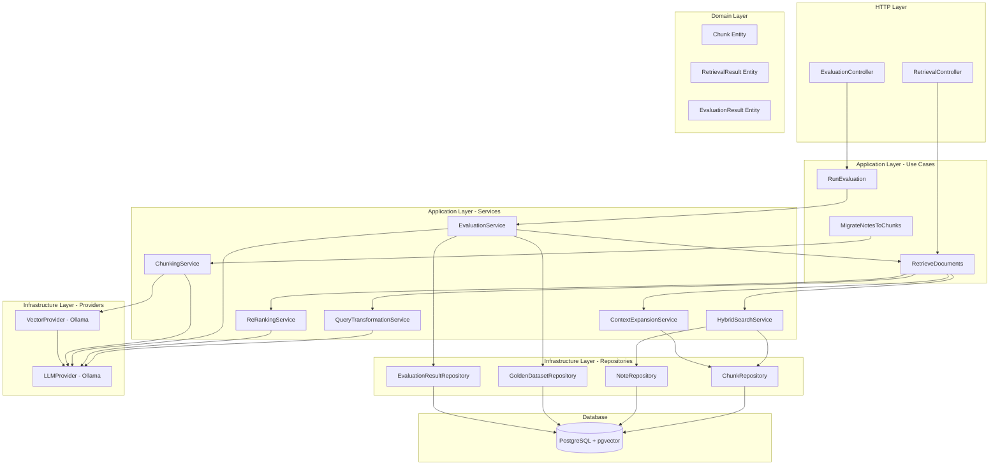
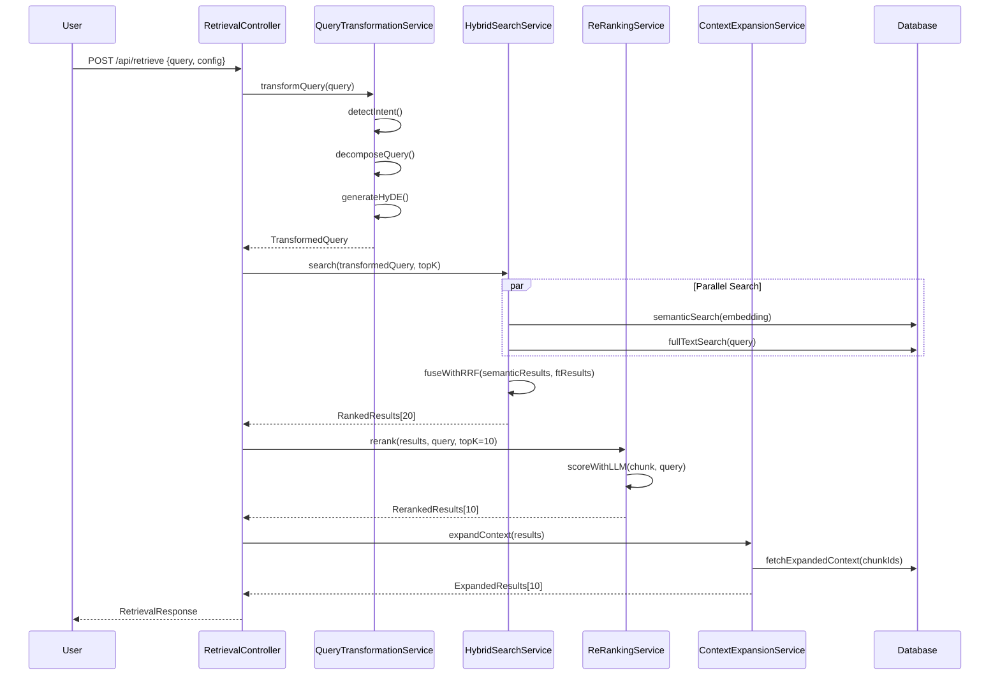
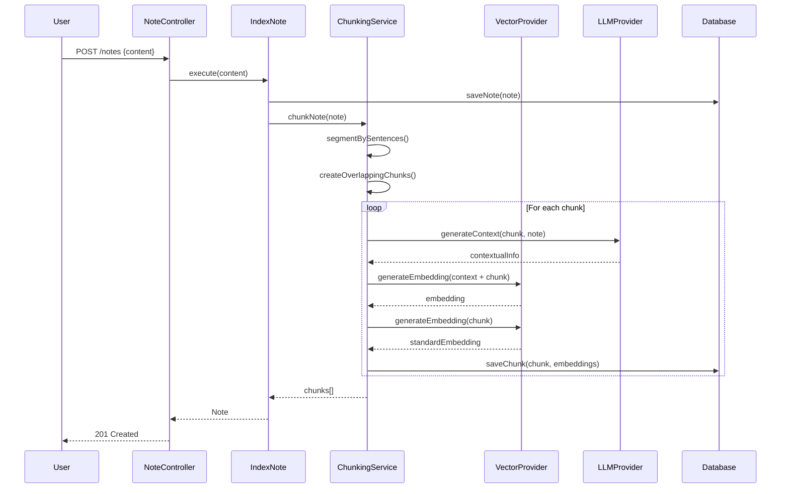

# Design Document: Production RAG Improvements

## Overview

This design document specifies the technical architecture for enhancing Brain Sync's Retrieval-Augmented Generation (RAG) system from ~60% to 85%+ retrieval accuracy. The improvements introduce hybrid search (semantic + full-text), re-ranking, intelligent chunking, query transformation, sentence-window retrieval, contextual embeddings, GraphRAG enhancement, and a comprehensive evaluation framework.

### Goals

1. Improve Hit_Rate@10 from ~60% to 85%+ through multi-stage retrieval pipeline
2. Maintain end-to-end retrieval latency p95 < 2000ms
3. Support Spanish language throughout all components
4. Preserve backward compatibility with existing notes and APIs
5. Enable A/B testing and continuous evaluation of retrieval strategies

### Non-Goals

1. Replacing the existing LangGraph agent infrastructure
2. Implementing custom embedding models (continue using Ollama)
3. Building a custom vector database (continue using pgvector)
4. Supporting languages other than Spanish
5. Real-time streaming of retrieval results

### Key Design Decisions

**Decision 1: Hybrid Search with RRF**
- Rationale: Combines semantic understanding with exact keyword matching. RRF (Reciprocal Rank Fusion) is simpler than learned fusion and performs well in practice.
- Alternative considered: Learned fusion weights - rejected due to complexity and training data requirements.

**Decision 2: Sentence-Window Retrieval**
- Rationale: Small chunks improve retrieval precision, but expanded context improves answer quality. This approach gets the best of both.
- Alternative considered: Fixed-size chunks - rejected because it loses context and may split semantic units.

**Decision 3: LLM-based Re-ranking Fallback**
- Rationale: Cross-encoders are ideal but require additional model deployment. LLM fallback ensures functionality without infrastructure changes.
- Alternative considered: No re-ranking - rejected because initial retrieval often misses relevance nuances.

**Decision 4: Incremental Migration Strategy**
- Rationale: Allows gradual rollout without downtime. System supports both chunked and non-chunked notes during transition.
- Alternative considered: Big-bang migration - rejected due to risk and potential data loss.

**Decision 5: PostgreSQL Full-Text Search**
- Rationale: Leverages existing database infrastructure, supports Spanish stemming, and integrates seamlessly with vector search.
- Alternative considered: Elasticsearch - rejected to avoid additional infrastructure complexity.


## Architecture

### High-Level Architecture



### Retrieval Pipeline Flow



### Data Flow for Note Indexing



### Component Responsibilities

#### Application Layer Services

**QueryTransformationService**
- Detects query intent (factual, causal, temporal, comparative)
- Decomposes complex multi-part queries into sub-queries
- Generates hypothetical answers using HyDE for abstract queries
- Returns structured transformation with original query preserved

**HybridSearchService**
- Executes semantic search using pgvector cosine similarity
- Executes full-text search using PostgreSQL tsvector
- Applies RRF algorithm to fuse ranked results
- Returns top-k combined results with scores

**ReRankingService**
- Scores chunk-query pairs for relevance
- Uses LLM-based scoring (cross-encoder support for future)
- Batches scoring requests for efficiency
- Returns reordered results with normalized scores

**ContextExpansionService**
- Expands retrieved chunks by N sentences before/after
- Fetches expanded context from parent notes
- Merges overlapping contexts from adjacent chunks
- Marks original matched chunk within expanded context

**ChunkingService**
- Segments notes by sentence boundaries
- Creates overlapping chunks with configurable size/overlap
- Generates contextual information using LLM
- Produces both standard and contextual embeddings
- Stores chunk metadata (boundaries, indices)

**EvaluationService**
- Runs retrieval evaluation on golden dataset
- Computes Hit_Rate@k, MRR, precision, recall
- Uses LLM to evaluate faithfulness and answer relevance
- Stores results with configuration hash for comparison
- Generates comparison reports between configurations

#### Domain Entities

**Chunk**
```typescript
class Chunk {
    constructor(
        public readonly id: string,
        public readonly noteId: string,
        public readonly content: string,
        public readonly chunkIndex: number,
        public readonly startChar: number,
        public readonly endChar: number,
        public readonly embedding: number[],
        public readonly contextualEmbedding: number[],
        public readonly createdAt: Date
    ) {}
}
```

**RetrievalResult**
```typescript
class RetrievalResult {
    constructor(
        public readonly chunkId: string,
        public readonly noteId: string,
        public readonly content: string,
        public readonly expandedContent: string,
        public readonly score: number,
        public readonly metadata: RetrievalMetadata
    ) {}
}

interface RetrievalMetadata {
    originalScore?: number;
    rerankScore?: number;
    chunkIndex: number;
    matchedChunkBounds: { start: number; end: number };
    retrievalMethod: 'semantic' | 'fulltext' | 'hybrid';
}
```

**EvaluationResult**
```typescript
class EvaluationResult {
    constructor(
        public readonly id: string,
        public readonly configHash: string,
        public readonly hitRateK1: number,
        public readonly hitRateK3: number,
        public readonly hitRateK5: number,
        public readonly hitRateK10: number,
        public readonly mrr: number,
        public readonly faithfulness: number,
        public readonly answerRelevance: number,
        public readonly latencyP50: number,
        public readonly latencyP95: number,
        public readonly latencyP99: number,
        public readonly createdAt: Date
    ) {}
}
```

**GoldenDatasetEntry**
```typescript
class GoldenDatasetEntry {
    constructor(
        public readonly id: string,
        public readonly query: string,
        public readonly relevantNoteIds: string[],
        public readonly expectedAnswer: string,
        public readonly category: QueryCategory,
        public readonly difficulty: number,
        public readonly createdAt: Date
    ) {}
}

type QueryCategory = 'factual' | 'causal' | 'temporal' | 'comparative' | 'multi-part';
```


## Components and Interfaces

### Provider Interfaces

**Extended VectorProvider Interface**
```typescript
export interface VectorProvider {
    // Existing method
    generateEmbedding(text: string): Promise<number[]>;
    
    // New methods for batch processing
    generateEmbeddings(texts: string[]): Promise<number[][]>;
}
```

**Extended LLMProvider Interface**
```typescript
export interface LLMProvider {
    // Existing methods
    generateResponse(messages: ChatMessage[]): Promise<string>;
    generateStream(messages: ChatMessage[], signal?: AbortSignal): AsyncIterable<string>;
    
    // New methods for RAG improvements
    scoreRelevance(query: string, document: string): Promise<number>;
    evaluateFaithfulness(context: string, answer: string): Promise<number>;
    evaluateAnswerRelevance(query: string, answer: string, expectedAnswer: string): Promise<number>;
}
```

### Repository Interfaces

**ChunkRepository**
```typescript
export abstract class ChunkRepository {
    abstract save(chunk: Chunk): Promise<void>;
    abstract saveBatch(chunks: Chunk[]): Promise<void>;
    abstract findById(id: string): Promise<Chunk | undefined>;
    abstract findByNoteId(noteId: string): Promise<Chunk[]>;
    abstract semanticSearch(queryVector: number[], limit: number, threshold: number): Promise<ChunkSearchResult[]>;
    abstract fullTextSearch(query: string, limit: number): Promise<ChunkSearchResult[]>;
    abstract findExpandedContext(chunkId: string, sentencesBefore: number, sentencesAfter: number): Promise<string>;
    abstract deleteByNoteId(noteId: string): Promise<void>;
}

interface ChunkSearchResult {
    chunk: Chunk;
    score: number;
    rank: number;
}
```

**GoldenDatasetRepository**
```typescript
export abstract class GoldenDatasetRepository {
    abstract save(entry: GoldenDatasetEntry): Promise<void>;
    abstract findById(id: string): Promise<GoldenDatasetEntry | undefined>;
    abstract findAll(): Promise<GoldenDatasetEntry[]>;
    abstract findByCategory(category: QueryCategory): Promise<GoldenDatasetEntry[]>;
    abstract update(id: string, entry: Partial<GoldenDatasetEntry>): Promise<void>;
    abstract delete(id: string): Promise<void>;
    abstract exportToJson(): Promise<string>;
    abstract importFromJson(json: string): Promise<void>;
}
```

**EvaluationResultRepository**
```typescript
export abstract class EvaluationResultRepository {
    abstract save(result: EvaluationResult): Promise<void>;
    abstract findById(id: string): Promise<EvaluationResult | undefined>;
    abstract findByConfigHash(configHash: string): Promise<EvaluationResult[]>;
    abstract findRecent(limit: number): Promise<EvaluationResult[]>;
    abstract compareConfigs(configHash1: string, configHash2: string): Promise<ComparisonReport>;
}

interface ComparisonReport {
    config1: EvaluationResult;
    config2: EvaluationResult;
    improvements: {
        hitRateK10: number;
        mrr: number;
        faithfulness: number;
        answerRelevance: number;
    };
    statisticalSignificance: boolean;
}
```

### Service Interfaces

**QueryTransformationService**
```typescript
export class QueryTransformationService {
    constructor(private llmProvider: LLMProvider) {}
    
    async transform(query: string): Promise<TransformedQuery> {
        const intent = await this.detectIntent(query);
        const subQueries = await this.decomposeQuery(query);
        const hydeAnswer = intent === 'abstract' ? await this.generateHyDE(query) : null;
        
        return {
            originalQuery: query,
            intent,
            subQueries,
            hydeAnswer,
            timestamp: new Date()
        };
    }
    
    private async detectIntent(query: string): Promise<QueryIntent> {
        // Implementation details in algorithms section
    }
    
    private async decomposeQuery(query: string): Promise<string[]> {
        // Implementation details in algorithms section
    }
    
    private async generateHyDE(query: string): Promise<string> {
        // Implementation details in algorithms section
    }
}

interface TransformedQuery {
    originalQuery: string;
    intent: QueryIntent;
    subQueries: string[];
    hydeAnswer: string | null;
    timestamp: Date;
}

type QueryIntent = 'factual' | 'causal' | 'temporal' | 'comparative' | 'abstract';
```

**HybridSearchService**
```typescript
export class HybridSearchService {
    constructor(
        private chunkRepository: ChunkRepository,
        private vectorProvider: VectorProvider,
        private config: HybridSearchConfig
    ) {}
    
    async search(query: TransformedQuery, topK: number): Promise<RetrievalResult[]> {
        const embedding = await this.vectorProvider.generateEmbedding(
            query.hydeAnswer || query.originalQuery
        );
        
        const [semanticResults, ftResults] = await Promise.all([
            this.chunkRepository.semanticSearch(embedding, topK * 2, this.config.threshold),
            this.chunkRepository.fullTextSearch(query.originalQuery, topK * 2)
        ]);
        
        const fusedResults = this.fuseWithRRF(semanticResults, ftResults, topK);
        return fusedResults;
    }
    
    private fuseWithRRF(
        semanticResults: ChunkSearchResult[],
        ftResults: ChunkSearchResult[],
        topK: number
    ): RetrievalResult[] {
        // Implementation details in algorithms section
    }
}

interface HybridSearchConfig {
    threshold: number;
    rrfK: number;
    semanticWeight: number;
    fulltextWeight: number;
}
```

**ReRankingService**
```typescript
export class ReRankingService {
    constructor(
        private llmProvider: LLMProvider,
        private config: ReRankingConfig
    ) {}
    
    async rerank(results: RetrievalResult[], query: string, topK: number): Promise<RetrievalResult[]> {
        if (!this.config.enabled) {
            return results.slice(0, topK);
        }
        
        const scoredResults = await this.batchScore(results, query);
        scoredResults.sort((a, b) => b.score - a.score);
        
        return scoredResults.slice(0, topK);
    }
    
    private async batchScore(results: RetrievalResult[], query: string): Promise<RetrievalResult[]> {
        const batchSize = this.config.batchSize;
        const batches = this.createBatches(results, batchSize);
        
        const scoredBatches = await Promise.all(
            batches.map(batch => this.scoreBatch(batch, query))
        );
        
        return scoredBatches.flat();
    }
    
    private async scoreBatch(batch: RetrievalResult[], query: string): Promise<RetrievalResult[]> {
        return Promise.all(
            batch.map(async result => {
                const score = await this.llmProvider.scoreRelevance(query, result.content);
                return {
                    ...result,
                    score,
                    metadata: {
                        ...result.metadata,
                        originalScore: result.score,
                        rerankScore: score
                    }
                };
            })
        );
    }
    
    private createBatches<T>(items: T[], batchSize: number): T[][] {
        const batches: T[][] = [];
        for (let i = 0; i < items.length; i += batchSize) {
            batches.push(items.slice(i, i + batchSize));
        }
        return batches;
    }
}

interface ReRankingConfig {
    enabled: boolean;
    batchSize: number;
    timeout: number;
}
```

**ContextExpansionService**
```typescript
export class ContextExpansionService {
    constructor(
        private chunkRepository: ChunkRepository,
        private config: ContextExpansionConfig
    ) {}
    
    async expand(results: RetrievalResult[]): Promise<RetrievalResult[]> {
        return Promise.all(
            results.map(async result => {
                const expandedContent = await this.chunkRepository.findExpandedContext(
                    result.chunkId,
                    this.config.sentencesBefore,
                    this.config.sentencesAfter
                );
                
                return {
                    ...result,
                    expandedContent,
                    metadata: {
                        ...result.metadata,
                        matchedChunkBounds: {
                            start: result.content.indexOf(result.content),
                            end: result.content.length
                        }
                    }
                };
            })
        );
    }
}

interface ContextExpansionConfig {
    sentencesBefore: number;
    sentencesAfter: number;
}
```

**ChunkingService**
```typescript
export class ChunkingService {
    constructor(
        private vectorProvider: VectorProvider,
        private llmProvider: LLMProvider,
        private config: ChunkingConfig
    ) {}
    
    async chunkNote(note: Note): Promise<Chunk[]> {
        const sentences = this.segmentBySentences(note.content);
        const chunkBoundaries = this.createChunkBoundaries(sentences);
        
        const chunks: Chunk[] = [];
        for (let i = 0; i < chunkBoundaries.length; i++) {
            const boundary = chunkBoundaries[i];
            const chunkContent = note.content.substring(boundary.start, boundary.end);
            
            const contextualInfo = await this.generateContextualInfo(
                chunkContent,
                note.content,
                i,
                chunkBoundaries.length
            );
            
            const [embedding, contextualEmbedding] = await Promise.all([
                this.vectorProvider.generateEmbedding(chunkContent),
                this.vectorProvider.generateEmbedding(`${contextualInfo}\n\n${chunkContent}`)
            ]);
            
            chunks.push(new Chunk(
                randomUUID(),
                note.id,
                chunkContent,
                i,
                boundary.start,
                boundary.end,
                embedding,
                contextualEmbedding,
                new Date()
            ));
        }
        
        return chunks;
    }
    
    private segmentBySentences(text: string): string[] {
        // Spanish sentence segmentation
        // Implementation details in algorithms section
    }
    
    private createChunkBoundaries(sentences: string[]): ChunkBoundary[] {
        // Implementation details in algorithms section
    }
    
    private async generateContextualInfo(
        chunk: string,
        fullNote: string,
        index: number,
        totalChunks: number
    ): Promise<string> {
        // Implementation details in algorithms section
    }
}

interface ChunkingConfig {
    maxChunkSize: number;
    overlapSize: number;
    minChunkSize: number;
}

interface ChunkBoundary {
    start: number;
    end: number;
}
```

**EvaluationService**
```typescript
export class EvaluationService {
    constructor(
        private goldenDatasetRepo: GoldenDatasetRepository,
        private evaluationResultRepo: EvaluationResultRepository,
        private retrieveUseCase: RetrieveDocuments,
        private llmProvider: LLMProvider
    ) {}
    
    async runEvaluation(config: RetrievalConfig): Promise<EvaluationResult> {
        const testCases = await this.goldenDatasetRepo.findAll();
        const results: QueryEvaluationResult[] = [];
        const latencies: number[] = [];
        
        for (const testCase of testCases) {
            const startTime = Date.now();
            const retrievalResults = await this.retrieveUseCase.execute(testCase.query, config);
            const latency = Date.now() - startTime;
            latencies.push(latency);
            
            const hitAtK = this.computeHitAtK(retrievalResults, testCase.relevantNoteIds);
            const reciprocalRank = this.computeReciprocalRank(retrievalResults, testCase.relevantNoteIds);
            
            // Generate answer for faithfulness and relevance evaluation
            const answer = await this.generateAnswer(retrievalResults, testCase.query);
            const faithfulness = await this.llmProvider.evaluateFaithfulness(
                retrievalResults.map(r => r.content).join('\n'),
                answer
            );
            const answerRelevance = await this.llmProvider.evaluateAnswerRelevance(
                testCase.query,
                answer,
                testCase.expectedAnswer
            );
            
            results.push({
                query: testCase.query,
                hitAtK,
                reciprocalRank,
                faithfulness,
                answerRelevance,
                latency
            });
        }
        
        const aggregated = this.aggregateResults(results, latencies);
        const evaluationResult = new EvaluationResult(
            randomUUID(),
            this.hashConfig(config),
            aggregated.hitRateK1,
            aggregated.hitRateK3,
            aggregated.hitRateK5,
            aggregated.hitRateK10,
            aggregated.mrr,
            aggregated.faithfulness,
            aggregated.answerRelevance,
            aggregated.latencyP50,
            aggregated.latencyP95,
            aggregated.latencyP99,
            new Date()
        );
        
        await this.evaluationResultRepo.save(evaluationResult);
        return evaluationResult;
    }
    
    private computeHitAtK(results: RetrievalResult[], relevantIds: string[], k: number): boolean {
        // Implementation details in algorithms section
    }
    
    private computeReciprocalRank(results: RetrievalResult[], relevantIds: string[]): number {
        // Implementation details in algorithms section
    }
    
    private aggregateResults(results: QueryEvaluationResult[], latencies: number[]): AggregatedMetrics {
        // Implementation details in algorithms section
    }
    
    private hashConfig(config: RetrievalConfig): string {
        // Implementation details in algorithms section
    }
    
    private async generateAnswer(results: RetrievalResult[], query: string): Promise<string> {
        // Use LLM to generate answer from retrieved context
    }
}

interface QueryEvaluationResult {
    query: string;
    hitAtK: { k1: boolean; k3: boolean; k5: boolean; k10: boolean };
    reciprocalRank: number;
    faithfulness: number;
    answerRelevance: number;
    latency: number;
}

interface AggregatedMetrics {
    hitRateK1: number;
    hitRateK3: number;
    hitRateK5: number;
    hitRateK10: number;
    mrr: number;
    faithfulness: number;
    answerRelevance: number;
    latencyP50: number;
    latencyP95: number;
    latencyP99: number;
}
```


## Data Models

### Database Schema Extensions

**chunks table**
```sql
CREATE TABLE chunks (
    id UUID PRIMARY KEY DEFAULT gen_random_uuid(),
    note_id UUID NOT NULL REFERENCES notes(id) ON DELETE CASCADE,
    content TEXT NOT NULL,
    chunk_index INTEGER NOT NULL,
    start_char INTEGER NOT NULL,
    end_char INTEGER NOT NULL,
    embedding vector(768),
    contextual_embedding vector(768),
    tsvector tsvector GENERATED ALWAYS AS (to_tsvector('spanish', content)) STORED,
    created_at TIMESTAMP NOT NULL DEFAULT NOW(),
    
    CONSTRAINT chunks_note_index_unique UNIQUE(note_id, chunk_index),
    CONSTRAINT chunks_bounds_valid CHECK(start_char >= 0 AND end_char > start_char)
);

-- Indexes for performance
CREATE INDEX idx_chunks_note_id ON chunks(note_id);
CREATE INDEX idx_chunks_embedding ON chunks USING ivfflat (embedding vector_cosine_ops) WITH (lists = 100);
CREATE INDEX idx_chunks_contextual_embedding ON chunks USING ivfflat (contextual_embedding vector_cosine_ops) WITH (lists = 100);
CREATE INDEX idx_chunks_tsvector ON chunks USING GIN(tsvector);
CREATE INDEX idx_chunks_created_at ON chunks(created_at DESC);
```

**golden_dataset table**
```sql
CREATE TABLE golden_dataset (
    id UUID PRIMARY KEY DEFAULT gen_random_uuid(),
    query TEXT NOT NULL,
    relevant_note_ids UUID[] NOT NULL,
    expected_answer TEXT NOT NULL,
    category TEXT NOT NULL CHECK(category IN ('factual', 'causal', 'temporal', 'comparative', 'multi-part')),
    difficulty INTEGER NOT NULL CHECK(difficulty BETWEEN 1 AND 5),
    tags TEXT[],
    created_at TIMESTAMP NOT NULL DEFAULT NOW(),
    updated_at TIMESTAMP NOT NULL DEFAULT NOW(),
    
    CONSTRAINT golden_dataset_query_unique UNIQUE(query)
);

CREATE INDEX idx_golden_dataset_category ON golden_dataset(category);
CREATE INDEX idx_golden_dataset_difficulty ON golden_dataset(difficulty);
```

**evaluation_results table**
```sql
CREATE TABLE evaluation_results (
    id UUID PRIMARY KEY DEFAULT gen_random_uuid(),
    config_hash TEXT NOT NULL,
    config_json JSONB NOT NULL,
    hit_rate_k1 DECIMAL(5,4) NOT NULL CHECK(hit_rate_k1 BETWEEN 0 AND 1),
    hit_rate_k3 DECIMAL(5,4) NOT NULL CHECK(hit_rate_k3 BETWEEN 0 AND 1),
    hit_rate_k5 DECIMAL(5,4) NOT NULL CHECK(hit_rate_k5 BETWEEN 0 AND 1),
    hit_rate_k10 DECIMAL(5,4) NOT NULL CHECK(hit_rate_k10 BETWEEN 0 AND 1),
    mrr DECIMAL(5,4) NOT NULL CHECK(mrr BETWEEN 0 AND 1),
    faithfulness DECIMAL(5,4) NOT NULL CHECK(faithfulness BETWEEN 0 AND 1),
    answer_relevance DECIMAL(5,4) NOT NULL CHECK(answer_relevance BETWEEN 0 AND 1),
    latency_p50 INTEGER NOT NULL,
    latency_p95 INTEGER NOT NULL,
    latency_p99 INTEGER NOT NULL,
    total_queries INTEGER NOT NULL,
    created_at TIMESTAMP NOT NULL DEFAULT NOW(),
    
    CONSTRAINT evaluation_results_latency_order CHECK(latency_p50 <= latency_p95 AND latency_p95 <= latency_p99)
);

CREATE INDEX idx_evaluation_results_config_hash ON evaluation_results(config_hash);
CREATE INDEX idx_evaluation_results_created_at ON evaluation_results(created_at DESC);
CREATE INDEX idx_evaluation_results_hit_rate_k10 ON evaluation_results(hit_rate_k10 DESC);
```

**notes table extension**
```sql
-- Add tsvector column to existing notes table
ALTER TABLE notes ADD COLUMN tsvector tsvector GENERATED ALWAYS AS (to_tsvector('spanish', content)) STORED;

-- Add GIN index for full-text search
CREATE INDEX idx_notes_tsvector ON notes USING GIN(tsvector);
```

### Configuration Schema

**RetrievalConfig**
```typescript
interface RetrievalConfig {
    strategy: 'semantic' | 'fulltext' | 'hybrid' | 'hybrid+rerank';
    
    // Chunking configuration
    chunking: {
        maxChunkSize: number;        // default: 512 tokens
        overlapSize: number;          // default: 50 tokens
        minChunkSize: number;         // default: 100 tokens
    };
    
    // Hybrid search configuration
    hybridSearch: {
        enabled: boolean;             // default: true
        rrfK: number;                 // default: 60
        semanticWeight: number;       // default: 0.5
        fulltextWeight: number;       // default: 0.5
        threshold: number;            // default: 0.5
    };
    
    // Re-ranking configuration
    reranking: {
        enabled: boolean;             // default: true
        batchSize: number;            // default: 5
        timeout: number;              // default: 5000ms
    };
    
    // Context expansion configuration
    contextExpansion: {
        enabled: boolean;             // default: true
        sentencesBefore: number;      // default: 2
        sentencesAfter: number;       // default: 2
    };
    
    // Query transformation configuration
    queryTransformation: {
        enabled: boolean;             // default: true
        enableHyDE: boolean;          // default: true
        enableDecomposition: boolean; // default: true
    };
    
    // Contextual embeddings configuration
    contextualEmbeddings: {
        enabled: boolean;             // default: true
        useForRetrieval: boolean;     // default: true
    };
    
    // Top-k configuration
    topK: {
        retrieval: number;            // default: 20
        reranking: number;            // default: 10
        final: number;                // default: 5
    };
    
    // GraphRAG configuration
    graphRAG: {
        enabled: boolean;             // default: true
        maxDepth: number;             // default: 3
        minRelevance: number;         // default: 0.6
    };
}
```

### Default Configuration

```typescript
export const DEFAULT_RETRIEVAL_CONFIG: RetrievalConfig = {
    strategy: 'hybrid+rerank',
    chunking: {
        maxChunkSize: 512,
        overlapSize: 50,
        minChunkSize: 100
    },
    hybridSearch: {
        enabled: true,
        rrfK: 60,
        semanticWeight: 0.5,
        fulltextWeight: 0.5,
        threshold: 0.5
    },
    reranking: {
        enabled: true,
        batchSize: 5,
        timeout: 5000
    },
    contextExpansion: {
        enabled: true,
        sentencesBefore: 2,
        sentencesAfter: 2
    },
    queryTransformation: {
        enabled: true,
        enableHyDE: true,
        enableDecomposition: true
    },
    contextualEmbeddings: {
        enabled: true,
        useForRetrieval: true
    },
    topK: {
        retrieval: 20,
        reranking: 10,
        final: 5
    },
    graphRAG: {
        enabled: true,
        maxDepth: 3,
        minRelevance: 0.6
    }
};
```

### Algorithms

#### Reciprocal Rank Fusion (RRF)

The RRF algorithm combines multiple ranked lists into a single ranked list. For each document, it computes a score based on its rank in each input list.

**Algorithm:**
```
Input: 
  - semanticResults: List of (document, rank) from semantic search
  - fulltextResults: List of (document, rank) from full-text search
  - k: RRF constant (default 60)
  - semanticWeight: Weight for semantic results (default 0.5)
  - fulltextWeight: Weight for full-text results (default 0.5)

Output:
  - fusedResults: Combined ranked list

Procedure:
1. Create a map: documentId -> rrfScore
2. For each document in semanticResults:
     score = semanticWeight / (k + rank)
     Add score to map[documentId]
3. For each document in fulltextResults:
     score = fulltextWeight / (k + rank)
     Add score to map[documentId]
4. Sort documents by rrfScore descending
5. Return top-k documents
```

**Implementation:**
```typescript
private fuseWithRRF(
    semanticResults: ChunkSearchResult[],
    ftResults: ChunkSearchResult[],
    topK: number
): RetrievalResult[] {
    const k = this.config.rrfK;
    const scoreMap = new Map<string, { chunk: Chunk; score: number }>();
    
    // Process semantic results
    semanticResults.forEach((result, index) => {
        const rank = index + 1;
        const score = this.config.semanticWeight / (k + rank);
        
        const existing = scoreMap.get(result.chunk.id);
        if (existing) {
            existing.score += score;
        } else {
            scoreMap.set(result.chunk.id, { chunk: result.chunk, score });
        }
    });
    
    // Process full-text results
    ftResults.forEach((result, index) => {
        const rank = index + 1;
        const score = this.config.fulltextWeight / (k + rank);
        
        const existing = scoreMap.get(result.chunk.id);
        if (existing) {
            existing.score += score;
        } else {
            scoreMap.set(result.chunk.id, { chunk: result.chunk, score });
        }
    });
    
    // Sort by score and convert to RetrievalResult
    const sortedResults = Array.from(scoreMap.values())
        .sort((a, b) => b.score - a.score)
        .slice(0, topK)
        .map(({ chunk, score }) => new RetrievalResult(
            chunk.id,
            chunk.noteId,
            chunk.content,
            chunk.content, // Will be expanded later
            score,
            {
                chunkIndex: chunk.chunkIndex,
                matchedChunkBounds: { start: 0, end: chunk.content.length },
                retrievalMethod: 'hybrid'
            }
        ));
    
    return sortedResults;
}
```

#### Intelligent Chunking with Sentence Boundaries

**Algorithm:**
```
Input:
  - text: Full note content
  - maxChunkSize: Maximum tokens per chunk (default 512)
  - overlapSize: Overlap tokens between chunks (default 50)
  - minChunkSize: Minimum tokens per chunk (default 100)

Output:
  - chunks: List of (content, startChar, endChar)

Procedure:
1. Segment text into sentences using Spanish sentence tokenizer
2. Initialize: currentChunk = [], currentSize = 0, chunks = []
3. For each sentence:
     a. tokenCount = countTokens(sentence)
     b. If currentSize + tokenCount <= maxChunkSize:
          - Add sentence to currentChunk
          - currentSize += tokenCount
     c. Else:
          - If currentSize >= minChunkSize:
              * Save currentChunk to chunks
              * Create overlap: keep last overlapSize tokens
              * Start new chunk with overlap + current sentence
          - Else if tokenCount > maxChunkSize:
              * Split sentence at clause boundaries
              * Process each clause recursively
          - Else:
              * Add sentence to currentChunk anyway (avoid tiny chunks)
4. Save final currentChunk if not empty
5. Return chunks with character boundaries
```

**Implementation:**
```typescript
private createChunkBoundaries(sentences: string[]): ChunkBoundary[] {
    const boundaries: ChunkBoundary[] = [];
    let currentStart = 0;
    let currentSentences: string[] = [];
    let currentTokens = 0;
    
    for (let i = 0; i < sentences.length; i++) {
        const sentence = sentences[i];
        const tokenCount = this.estimateTokenCount(sentence);
        
        if (currentTokens + tokenCount <= this.config.maxChunkSize) {
            currentSentences.push(sentence);
            currentTokens += tokenCount;
        } else {
            // Save current chunk if it meets minimum size
            if (currentTokens >= this.config.minChunkSize) {
                const chunkText = currentSentences.join(' ');
                boundaries.push({
                    start: currentStart,
                    end: currentStart + chunkText.length
                });
                
                // Create overlap
                const overlapSentences = this.getOverlapSentences(
                    currentSentences,
                    this.config.overlapSize
                );
                const overlapText = overlapSentences.join(' ');
                
                currentStart = currentStart + chunkText.length - overlapText.length;
                currentSentences = [...overlapSentences, sentence];
                currentTokens = this.estimateTokenCount(currentSentences.join(' '));
            } else {
                // Chunk too small, add sentence anyway
                currentSentences.push(sentence);
                currentTokens += tokenCount;
            }
        }
    }
    
    // Save final chunk
    if (currentSentences.length > 0) {
        const chunkText = currentSentences.join(' ');
        boundaries.push({
            start: currentStart,
            end: currentStart + chunkText.length
        });
    }
    
    return boundaries;
}

private segmentBySentences(text: string): string[] {
    // Spanish sentence segmentation
    // Handles abbreviations, decimals, and Spanish punctuation
    const sentenceRegex = /[^.!?¿¡]+[.!?¿¡]+/g;
    const sentences = text.match(sentenceRegex) || [text];
    return sentences.map(s => s.trim()).filter(s => s.length > 0);
}

private estimateTokenCount(text: string): number {
    // Rough estimation: 1 token ≈ 4 characters for Spanish
    return Math.ceil(text.length / 4);
}

private getOverlapSentences(sentences: string[], overlapTokens: number): string[] {
    const overlap: string[] = [];
    let tokenCount = 0;
    
    for (let i = sentences.length - 1; i >= 0; i--) {
        const sentence = sentences[i];
        const tokens = this.estimateTokenCount(sentence);
        
        if (tokenCount + tokens <= overlapTokens) {
            overlap.unshift(sentence);
            tokenCount += tokens;
        } else {
            break;
        }
    }
    
    return overlap;
}
```

#### Contextual Embedding Generation

**Algorithm:**
```
Input:
  - chunk: Chunk content
  - fullNote: Full note content
  - chunkIndex: Position of chunk in note
  - totalChunks: Total number of chunks in note

Output:
  - contextualInfo: String to prepend to chunk for embedding

Procedure:
1. Generate note summary using LLM (first 200 chars or cached summary)
2. Identify surrounding topics:
     - Previous chunk topic (if exists)
     - Next chunk topic (if exists)
3. Create contextual prompt:
     "This is part {chunkIndex + 1} of {totalChunks} from a note about: {summary}.
      Previous context: {prevTopic}. Following context: {nextTopic}."
4. Return contextual info
```

**Implementation:**
```typescript
private async generateContextualInfo(
    chunk: string,
    fullNote: string,
    index: number,
    totalChunks: number
): Promise<string> {
    // Generate or retrieve cached summary
    const summary = fullNote.length > 200 
        ? fullNote.substring(0, 200) + '...'
        : fullNote;
    
    const contextParts: string[] = [
        `Parte ${index + 1} de ${totalChunks} de una nota sobre: ${summary}`
    ];
    
    // Add position context
    if (index === 0) {
        contextParts.push('Esta es la sección inicial.');
    } else if (index === totalChunks - 1) {
        contextParts.push('Esta es la sección final.');
    } else {
        contextParts.push('Esta es una sección intermedia.');
    }
    
    return contextParts.join(' ');
}
```

#### Query Intent Detection

**Algorithm:**
```
Input:
  - query: User query string

Output:
  - intent: QueryIntent ('factual' | 'causal' | 'temporal' | 'comparative' | 'abstract')

Procedure:
1. Check for causal keywords: "por qué", "causa", "razón", "debido a"
     -> Return 'causal'
2. Check for temporal keywords: "cuándo", "antes", "después", "durante"
     -> Return 'temporal'
3. Check for comparative keywords: "diferencia", "comparar", "mejor", "peor"
     -> Return 'comparative'
4. Check for factual keywords: "qué", "quién", "dónde", "cuál"
     -> Return 'factual'
5. Default: Return 'abstract'
```

**Implementation:**
```typescript
private async detectIntent(query: string): Promise<QueryIntent> {
    const lowerQuery = query.toLowerCase();
    
    // Causal patterns
    const causalPatterns = ['por qué', 'por que', 'causa', 'razón', 'debido a', 'provoca', 'genera'];
    if (causalPatterns.some(p => lowerQuery.includes(p))) {
        return 'causal';
    }
    
    // Temporal patterns
    const temporalPatterns = ['cuándo', 'cuando', 'antes', 'después', 'durante', 'fecha', 'momento'];
    if (temporalPatterns.some(p => lowerQuery.includes(p))) {
        return 'temporal';
    }
    
    // Comparative patterns
    const comparativePatterns = ['diferencia', 'comparar', 'mejor', 'peor', 'versus', 'vs', 'entre'];
    if (comparativePatterns.some(p => lowerQuery.includes(p))) {
        return 'comparative';
    }
    
    // Factual patterns
    const factualPatterns = ['qué', 'que', 'quién', 'quien', 'dónde', 'donde', 'cuál', 'cual'];
    if (factualPatterns.some(p => lowerQuery.includes(p))) {
        return 'factual';
    }
    
    return 'abstract';
}
```

#### HyDE (Hypothetical Document Embeddings)

**Algorithm:**
```
Input:
  - query: User query

Output:
  - hypotheticalAnswer: Generated answer to embed

Procedure:
1. Create prompt: "Genera una respuesta hipotética detallada a esta pregunta: {query}"
2. Call LLM with prompt
3. Return generated answer
4. Embed the answer instead of the query for retrieval
```

**Implementation:**
```typescript
private async generateHyDE(query: string): Promise<string> {
    const prompt = `Genera una respuesta hipotética detallada a esta pregunta, como si estuvieras respondiendo desde una nota personal de diario:

Pregunta: ${query}

Respuesta hipotética:`;
    
    const messages: ChatMessage[] = [
        { role: 'system', content: 'Eres un asistente que genera respuestas hipotéticas para mejorar la búsqueda.' },
        { role: 'user', content: prompt }
    ];
    
    const hydeAnswer = await this.llmProvider.generateResponse(messages);
    return hydeAnswer;
}
```


#### Evaluation Metrics Computation

**Hit Rate @ k**
```
Input:
  - retrievedResults: List of retrieved document IDs
  - relevantIds: List of ground truth relevant document IDs
  - k: Top-k threshold

Output:
  - hit: Boolean (true if any relevant doc in top-k)

Procedure:
1. Take top-k results from retrievedResults
2. Check if any result.noteId is in relevantIds
3. Return true if found, false otherwise
```

**Implementation:**
```typescript
private computeHitAtK(
    results: RetrievalResult[],
    relevantIds: string[],
    k: number
): boolean {
    const topK = results.slice(0, k);
    return topK.some(result => relevantIds.includes(result.noteId));
}
```

**Mean Reciprocal Rank (MRR)**
```
Input:
  - retrievedResults: List of retrieved document IDs
  - relevantIds: List of ground truth relevant document IDs

Output:
  - reciprocalRank: 1/rank of first relevant doc (0 if none found)

Procedure:
1. For each result in retrievedResults (with rank starting at 1):
     a. If result.noteId is in relevantIds:
          - Return 1 / rank
2. If no relevant doc found, return 0
```

**Implementation:**
```typescript
private computeReciprocalRank(
    results: RetrievalResult[],
    relevantIds: string[]
): number {
    for (let i = 0; i < results.length; i++) {
        const rank = i + 1;
        if (relevantIds.includes(results[i].noteId)) {
            return 1 / rank;
        }
    }
    return 0;
}
```

**Aggregated Metrics**
```
Input:
  - queryResults: List of per-query evaluation results
  - latencies: List of latency measurements

Output:
  - aggregated: AggregatedMetrics

Procedure:
1. Hit Rate @ k = (count of queries with hit @ k) / (total queries)
2. MRR = average of all reciprocal ranks
3. Faithfulness = average of all faithfulness scores
4. Answer Relevance = average of all answer relevance scores
5. Latency percentiles:
     - Sort latencies
     - p50 = latencies[floor(0.50 * length)]
     - p95 = latencies[floor(0.95 * length)]
     - p99 = latencies[floor(0.99 * length)]
```

**Implementation:**
```typescript
private aggregateResults(
    results: QueryEvaluationResult[],
    latencies: number[]
): AggregatedMetrics {
    const totalQueries = results.length;
    
    // Hit rates
    const hitRateK1 = results.filter(r => r.hitAtK.k1).length / totalQueries;
    const hitRateK3 = results.filter(r => r.hitAtK.k3).length / totalQueries;
    const hitRateK5 = results.filter(r => r.hitAtK.k5).length / totalQueries;
    const hitRateK10 = results.filter(r => r.hitAtK.k10).length / totalQueries;
    
    // MRR
    const mrr = results.reduce((sum, r) => sum + r.reciprocalRank, 0) / totalQueries;
    
    // Faithfulness and Answer Relevance
    const faithfulness = results.reduce((sum, r) => sum + r.faithfulness, 0) / totalQueries;
    const answerRelevance = results.reduce((sum, r) => sum + r.answerRelevance, 0) / totalQueries;
    
    // Latency percentiles
    const sortedLatencies = [...latencies].sort((a, b) => a - b);
    const latencyP50 = sortedLatencies[Math.floor(0.50 * sortedLatencies.length)];
    const latencyP95 = sortedLatencies[Math.floor(0.95 * sortedLatencies.length)];
    const latencyP99 = sortedLatencies[Math.floor(0.99 * sortedLatencies.length)];
    
    return {
        hitRateK1,
        hitRateK3,
        hitRateK5,
        hitRateK10,
        mrr,
        faithfulness,
        answerRelevance,
        latencyP50,
        latencyP95,
        latencyP99
    };
}
```

**Configuration Hashing**
```
Input:
  - config: RetrievalConfig

Output:
  - hash: String hash of configuration

Procedure:
1. Serialize config to JSON string
2. Compute SHA-256 hash
3. Return first 16 characters of hex digest
```

**Implementation:**
```typescript
private hashConfig(config: RetrievalConfig): string {
    const crypto = require('crypto');
    const configJson = JSON.stringify(config, Object.keys(config).sort());
    const hash = crypto.createHash('sha256').update(configJson).digest('hex');
    return hash.substring(0, 16);
}
```

#### Sentence-Window Context Expansion

**Algorithm:**
```
Input:
  - chunkId: ID of matched chunk
  - sentencesBefore: Number of sentences to include before
  - sentencesAfter: Number of sentences to include after

Output:
  - expandedContent: String with expanded context

Procedure:
1. Fetch chunk from database
2. Fetch parent note content
3. Locate chunk position in note using startChar and endChar
4. Extract text before chunk, segment into sentences
5. Extract text after chunk, segment into sentences
6. Take last N sentences before chunk
7. Take first N sentences after chunk
8. Concatenate: beforeContext + chunk + afterContext
9. Return expanded content
```

**Implementation:**
```typescript
async findExpandedContext(
    chunkId: string,
    sentencesBefore: number,
    sentencesAfter: number
): Promise<string> {
    // Fetch chunk
    const chunk = await this.findById(chunkId);
    if (!chunk) {
        throw new AppError('Chunk not found', 404);
    }
    
    // Fetch parent note
    const note = await this.noteRepository.findById(chunk.noteId);
    if (!note) {
        throw new AppError('Parent note not found', 404);
    }
    
    // Extract context before chunk
    const textBefore = note.content.substring(0, chunk.startChar);
    const sentencesBef = this.segmentBySentences(textBefore);
    const contextBefore = sentencesBef.slice(-sentencesBefore).join(' ');
    
    // Extract context after chunk
    const textAfter = note.content.substring(chunk.endChar);
    const sentencesAft = this.segmentBySentences(textAfter);
    const contextAfter = sentencesAft.slice(0, sentencesAfter).join(' ');
    
    // Combine
    const expandedContent = [
        contextBefore,
        chunk.content,
        contextAfter
    ].filter(s => s.length > 0).join(' ');
    
    return expandedContent;
}

private segmentBySentences(text: string): string[] {
    const sentenceRegex = /[^.!?¿¡]+[.!?¿¡]+/g;
    const sentences = text.match(sentenceRegex) || [text];
    return sentences.map(s => s.trim()).filter(s => s.length > 0);
}
```

#### GraphRAG Causal Path Traversal

**Algorithm:**
```
Input:
  - query: User query
  - intent: Query intent (must be 'causal')
  - maxDepth: Maximum traversal depth
  - minRelevance: Minimum relevance threshold

Output:
  - causalResults: List of notes in causal paths

Procedure:
1. Extract entities from query using NER or keyword matching
2. Find entity IDs in graph database
3. For each entity:
     a. Traverse relationships of type CAUSES, TRIGGERS, LEADS_TO
     b. Limit depth to maxDepth
     c. Collect all connected entities
4. Retrieve notes associated with collected entities
5. Score notes by path relevance (shorter paths = higher relevance)
6. Filter by minRelevance threshold
7. Return sorted results
```

**Implementation:**
```typescript
async findCausalPaths(
    query: string,
    maxDepth: number,
    minRelevance: number
): Promise<RetrievalResult[]> {
    // Extract entities from query (simplified - could use NER)
    const entities = await this.extractEntities(query);
    
    const causalResults: RetrievalResult[] = [];
    const visitedNotes = new Set<string>();
    
    for (const entity of entities) {
        // Find entity in graph
        const entityId = await this.findEntityId(entity);
        if (!entityId) continue;
        
        // Traverse causal relationships
        const paths = await this.traverseCausalGraph(entityId, maxDepth);
        
        for (const path of paths) {
            const relevance = this.computePathRelevance(path, maxDepth);
            if (relevance < minRelevance) continue;
            
            // Get notes for entities in path
            for (const nodeId of path.nodes) {
                const note = await this.getNoteForEntity(nodeId);
                if (note && !visitedNotes.has(note.id)) {
                    visitedNotes.add(note.id);
                    causalResults.push(new RetrievalResult(
                        note.id,
                        note.id,
                        note.content,
                        note.content,
                        relevance,
                        {
                            chunkIndex: 0,
                            matchedChunkBounds: { start: 0, end: note.content.length },
                            retrievalMethod: 'graph',
                            causalPath: path.nodes
                        }
                    ));
                }
            }
        }
    }
    
    // Sort by relevance
    causalResults.sort((a, b) => b.score - a.score);
    return causalResults;
}

private computePathRelevance(path: CausalPath, maxDepth: number): number {
    // Shorter paths are more relevant
    const depthPenalty = path.depth / maxDepth;
    return 1 - (depthPenalty * 0.5);
}

private async traverseCausalGraph(
    startNodeId: string,
    maxDepth: number
): Promise<CausalPath[]> {
    const paths: CausalPath[] = [];
    const queue: { nodeId: string; depth: number; path: string[] }[] = [
        { nodeId: startNodeId, depth: 0, path: [startNodeId] }
    ];
    const visited = new Set<string>();
    
    while (queue.length > 0) {
        const { nodeId, depth, path } = queue.shift()!;
        
        if (depth >= maxDepth) {
            paths.push({ nodes: path, depth });
            continue;
        }
        
        if (visited.has(nodeId)) continue;
        visited.add(nodeId);
        
        // Find causal relationships
        const relationships = await this.graphRepository.findRelated(
            nodeId,
            ['CAUSES', 'TRIGGERS', 'LEADS_TO']
        );
        
        for (const rel of relationships) {
            const nextNodeId = rel.targetId;
            queue.push({
                nodeId: nextNodeId,
                depth: depth + 1,
                path: [...path, nextNodeId]
            });
        }
        
        if (relationships.length === 0) {
            paths.push({ nodes: path, depth });
        }
    }
    
    return paths;
}

interface CausalPath {
    nodes: string[];
    depth: number;
}
```

